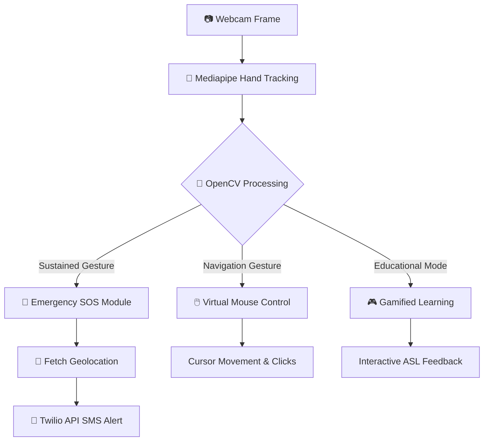

  <h1><b>SignVise</b></h1>
  <h3><i>An Integrated ML‑Based Platform for Gesture‑Driven Text, Control & Safety with Gamified Learning</i></h3>
   
  
  
  
  
  

## 🚨 **Problem Statement**
- **Inaccessibility in Crises**: Emergency situations often prevent manual device interaction.
- **Lack of Automation**: Existing systems lack automated gesture‑based detection.
- **Delayed Response Times**: Absence of real‑time location and visual context delays response.
- **The Need**: A low‑latency, hands‑free AI emergency alert mechanism.

---

## 💡 **Description & Solution**

**SignVise** tackles these challenges by transforming your device's camera into a powerful, hands-free interface.

- **Real-Time Tracking**: Hand landmark recognition powered by **Mediapipe**.
- **Frame Processing**: Video frame processing & gesture duration tracking with **OpenCV**.
- **Emergency SOS**: Emergency alert system leveraging computer vision for sustained gesture detection.
- **Automated Alerts**: Automated SMS delivery via **Twilio API**, integrated with real‑time geolocation tracking.
- **Virtual Control**: Gesture‑based cursor movement module designed for differently‑abled and bed‑ridden individuals.
- **Interactive Education**: Gamified learning experience for gesture recognition to enhance accessibility and engagement.
- **Robust Architecture**: Built with **Python**, ensuring modularity, scalability, and cross‑platform adaptability.

---

## ⚙️ **Workflow Architecture**

Here is a visual representation of how **SignVise** processes inputs and delivers actionable outputs:

---

## ⚙️ **Tech Stack**
- **Core Language**: Python  
- **Computer Vision**: Mediapipe, OpenCV  
- **Communication APIs**: Twilio API  
- **Location Services**: Geolocation APIs

---

## 🌍 **Impact**
- 🚑 Enables hands‑free emergency response in critical, life-threatening situations.
- ♿ Provides vital assistive technology and control for differently‑abled users.
- 🎓 Enhances learning and accessibility through a gamified gesture recognition journey.

---

## 📂 **Source Code**

📥 **[Download Source Code (ZIP) via Google Drive](https://drive.google.com/file/d/1InNBP2LUyAILm9k9iiz5uvlqZk4ZTF8k/view?usp=sharing)**  

---

## 🎬 **Demonstration Video**
📥 **[Download Demo Video](https://github.com/whisperinbinary/SignVise/raw/refs/heads/master/demo/Project%20SignVise%20Demo%20Video.mp4)**

---

## 💼 **LinkedIn Post**
🔗 **[View LinkedIn Update](https://www.linkedin.com/feed/update/urn:li:activity:7428827759898140672/)**

---

## 👥 **Contributors**

| Name | Role | Socials |
|------|------|---------|
| **Atal Sharma** | Project Lead & Backend (Chatbot & SOS Module) | [LinkedIn](https://www.linkedin.com/in/atal-sharma-2659aa370/) |
| **Harshit Sharma** | Backend Development (Text‑to‑Speech Module) | [LinkedIn](https://www.linkedin.com/in/harshit-sharma-4a167237b/) |
| **Abhishek Sharma** | Backend Development (Virtual Mouse Module) | [LinkedIn](https://www.linkedin.com/in/abhishek-sharma-765322370/) |
| **Pratyush Daspattnaik** | Frontend Development | [LinkedIn](https://www.linkedin.com/in/pratyush-daspattnaik-3b1a46366/) |

---

## 📷 **Project Visuals**

  
  
  

  
  

---

> **⚠️ Disclaimer:** This repository hosts the deployed application for demo purposes. Please note that any errors occurring due to incorrect user implementation or environmental misconfigurations must not be inferred as a development error.

---

  <i>Built by the Team PRAGYAAN</i>

